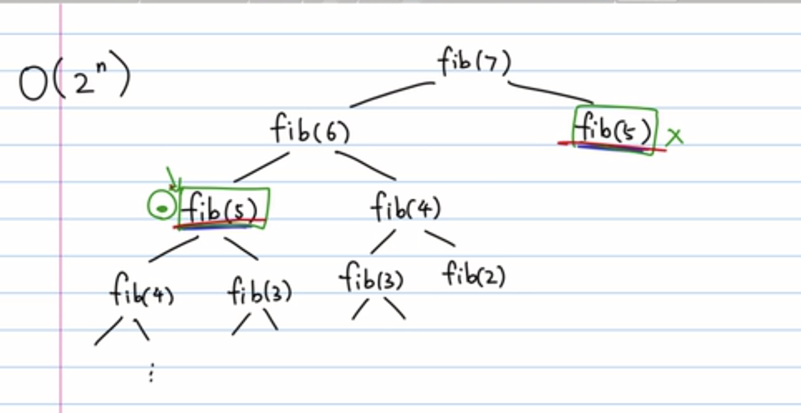
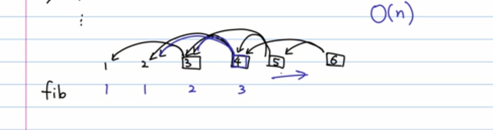
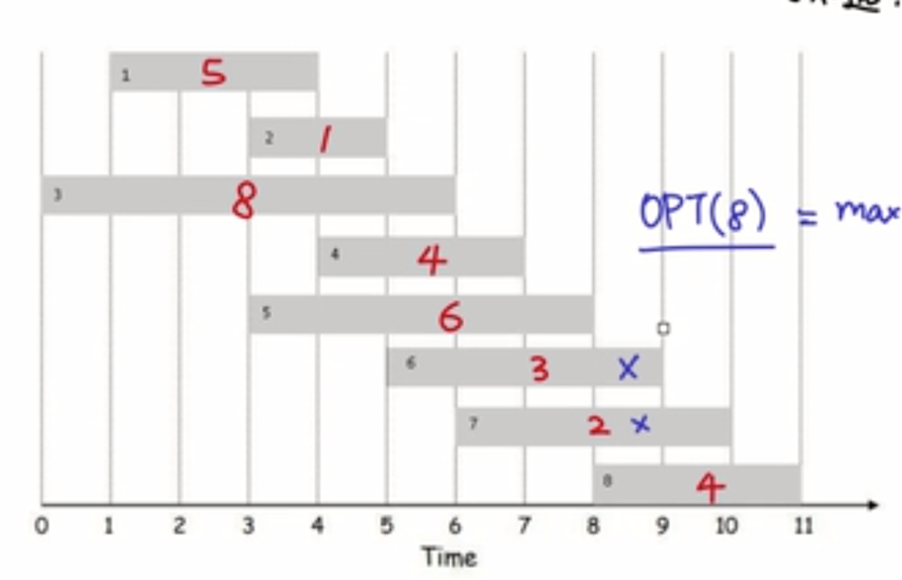
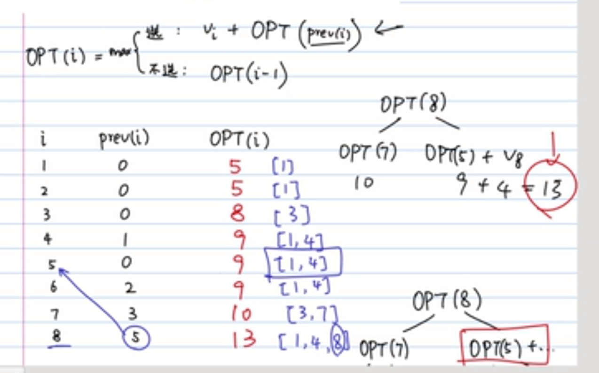
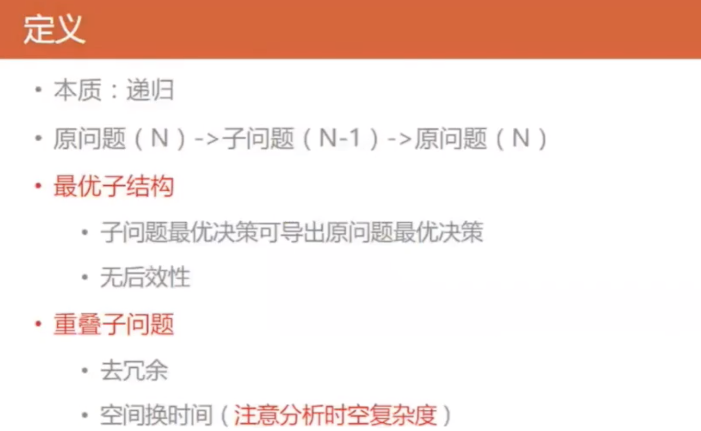
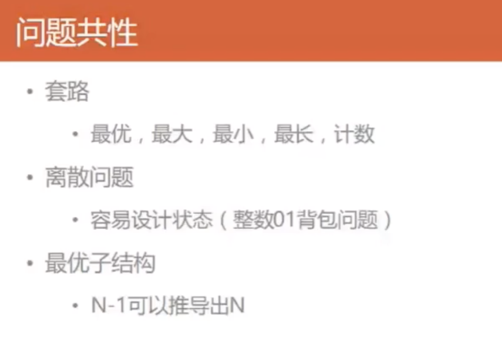
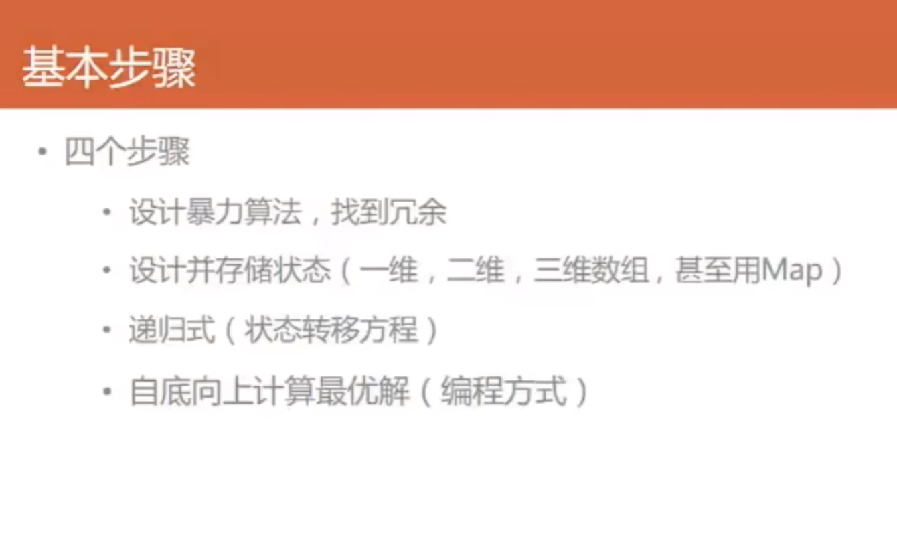
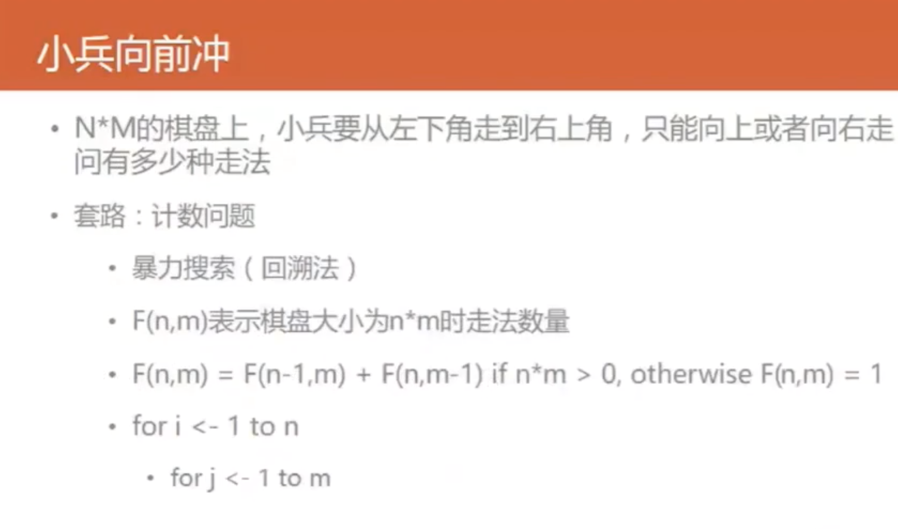
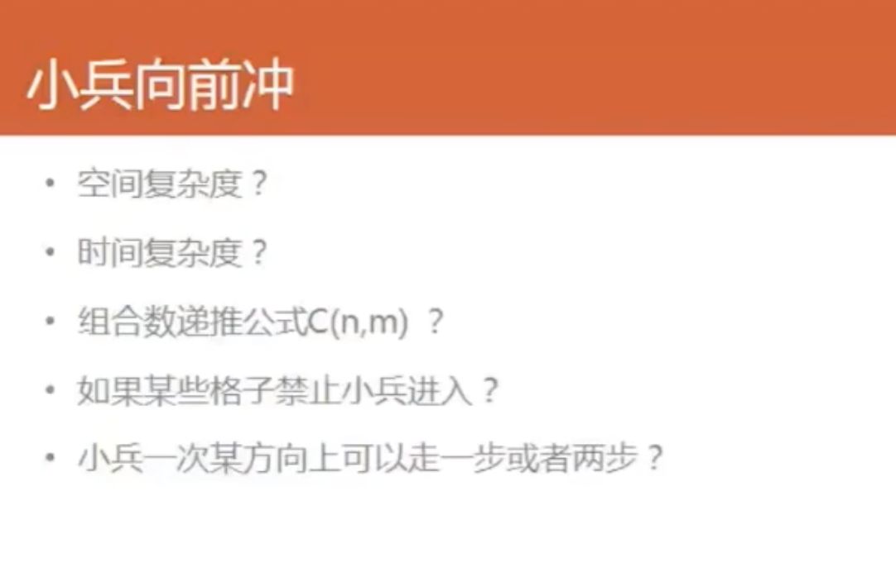
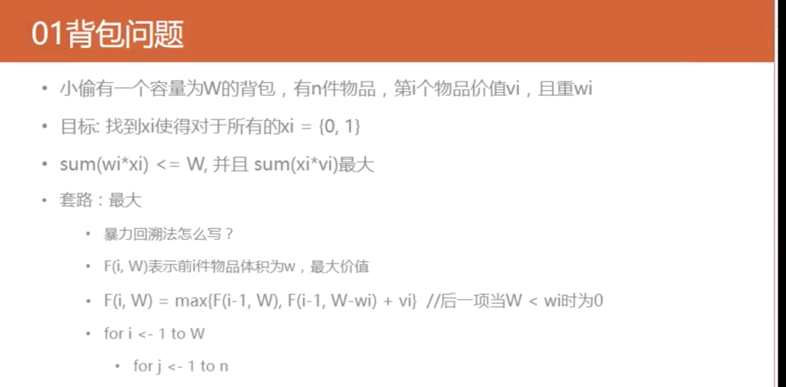

## Dynamic programming 

Fibonachi Sequence 

1 1 2 3 5 8 13 21

fib(n) = 1  n = 1 or 2

else 

fib(n) = fib(n-1) + fib(n-2)

overlap sub-problem



```cpp
int fib(int n) {
    if(n <= 1) {
        return 1;
    }
    return fib(n-1) + fib(n-2);
}
```

```cpp
// 递推
f[0] = 1;
f[1] = 1;
for(int i = 2; i < n; i++) {
    f[i] = f[i-1] + f[i-2];
}
```

如果递归展开的话我们需要重新计算fib(5),复杂度为O(2^N),我们要想办法去利用之前的值



```cpp
int fib(int n) {
    if(n <= 1) {
        return 1;
    }
    if(result[n] >= 0) {
        return result[n];
    }
    return fib(n-1) + fib(n-2);
}
```

如此overlap sub-problem子问题就变成了O(N)的复杂度




## 198. House Robber 01 暴搜

暴力搜索一定是递归，这题用暴搜超时，但是体现了上述过程的思想，比较当前值+prev的递归和上一个值的递归，这样我们问题规模就越变越小了，虽然这道题超时，但是思路值得借鉴。

时间复杂度分析，因为最多可能要N次，每次有2种决策，所以O(2^N)

我们来分析优化：

n-1 -> (n-3, n-4, n-5 ....)

n-2 -> (n-4, n-5 .....)

其中有很多重复计算

我们希望if(算过) return 结果



QA:c++类成员变量初始化(unsolved)

https://zhuanlan.zhihu.com/p/118692769

## 198. House Robber 02 dp

根据我们上面分析，我们用一个数组存储已经算过的值就可了

因为每一个状态我们只用算一遍，我们的时间复杂度为O(N),空间复杂度为O(N)





## 198. House Robber 03 dp 迭代

将上面这个自顶向下的递归改为自底向上的迭代，这样边界判断和前面数字处理会多一点，但逻辑会更加清晰。

## 198. House Robber 04 dp 迭代 滚动数组

其实我们这里只需要前两次的房屋就可了，所以我们只需要两个变量来存就可

## 小兵向前冲





```cpp
// 暴力回溯
int f(int m, int n) {
    if(m == 0 || n == 0) return 0;
    if(m == 1 || n == 1) return 1;
    return f(m-1, n) + f(m, n-1);
}
```

## 64. Minimum Path Sum 01 dp

Input:
[
  [1,3,1],
  [1,5,1],
  [4,2,1]
]

之前棋盘看多了，下意识左下是(0,0)了，这个是个很典型的dp问题，暴力的话，时间复杂度为O(2^N),我们这里状态转移方程为f(m,n) = min(f(m-1,n),f(m,n-1))+ grid(m,n).因为我们这里比较做小，边界条件超过的话就返回INT_MAX。时间复杂度是O(MN)，空面复杂度为O(MN)。

## 64. Minimum Path Sum 02 暴力

暴力超时，主要是可以得到状态转移方程，我们这里的时间复杂度为O(2^(M+N)),空间复杂度为O(M+N),因为递归的深度为M+N

## 64. Minimum Path Sum 03 二维dp 递推

这里我们建立一个二维的dp数组递推装最小的sum，我们先把最边缘的两边[0][j]和[i][0]给一路加上值，其他的是min(dp[i-1][j], dp[i][j-1]) + grid[i][j].这个是自底向上的递推。空间复杂度为O(M*N),时间复杂度为O(M*N)

## 64. Minimum Path Sum 03 递推，无需额外空间

因为这个只用遍历一次二维数组，所以我们不需要额外空间。

空间复杂度为O(1),时间复杂度为O(M*N)

## 01背包问题



```cpp
// 暴力法
int w[n], v[n], W;

// S <= W
int search(int idx, int S) {
    if(S > W) return 0;
    if(idx >= 0) return 0;
    return max(search(idx + 1, S+ w[idx]) + v[idx], search(idx + 1, S));
}
```

```cpp
int w[n], v[n], W;

int search(int idx, int S) {
    if(S > W) return 0;
    if(idx >= 0) return 0;
    if(f[idx][S] >= 0) return f[idx][S];
    f[idx][S] = max(search(idx + 1, S+ w[idx]) + v[idx], search(idx + 1, S));
    return f[idx][S];
}
```

```cpp
// 递推
f[0][0] = 0;
for(int i = 1; i <= W; ++i){
    f[0][i] = -maxValue;
}
for(int idx = 1; i <= n; ++idx) {
    f[idx][0] = 0;
    for(int j = 1; j <= W; ++j) {
        f[idx][j] = f[idx -1][j];
        if(j >= w[idx]) 
            f[idx][j] = max(f[idx-1][j - w[idx]] + v[idx], f[idx][j]);
    }
}
```

## 322. Coin Change 01 暴力

这里我们的状态就是两个，一种是选择search(idx, amount-coins[idx], coins)+1，一种是不选择search(idx-1, amount, coins)，直接进行到下一种面值不增加。

时间复杂度为O(2^(K*N))

## 322. Coin Change 02 dp 开二维数组备忘录

这里有点蠢，但是没得办法，这种暴力是有两种状态决定的，一种是amount，一种是面值，开了个 N* K大小的数组，因为N可能很大，这里时间复杂度就降为了O(N*K),空间复杂度为O(K*N)，但是这种的overlap问题也不是很好的解决，因为10分为了10(1),10(2),10(5).

## 322. Coin Change 03 另一种暴力

时间复杂度分析: 子问题总数 * 解决每个子问题的时间

这个多叉树的结点有(N^K)，相当于每一个都遍历一下，每一个子问题带有一个循环，所以时间复杂度为O(K*N^K)

## 322. Coin Change 04 上个暴力的dp

因为这里就一个变化量amount，所以我们开一个一维数组存mount状态，我们这里的时间复杂度为O(K*N)，空间复杂度为O(N)

## 322. Coin Change 05 递推1

应用DP框架：

```
# 初始化 base case
dp[0][0][...] = base
# 进行状态转移
for 状态1 in 状态1的所有取值：
    for 状态2 in 状态2的所有取值：
        for ...
            dp[状态1][状态2][...] = 求最值(选择1，选择2...)
```

时间复杂度为O(K*N)，空间复杂度为(N)


## 746. Min Cost Climbing Stairs 01 暴力

肯定不能过，只是第一步找出暴力搜索，然后去优化

## 746. Min Cost Climbing Stairs 02 dp 递归

和其他dp一样，我们这里需要都遍历一次，时间复杂度为O(N),空间复杂度为O(N)。

这里我们遇到一个问题就是，我们最后一个是走还是不走，我们精妙的添加一个0，如果不走的话我们选到下一个阶梯就为0即可。

状态转移方程也是把大问题拆成小问题，将最小的前面方案加上当前。

## 746. Min Cost Climbing Stairs 03 递推

学会将递归改为递推，即自顶向下改为自底向上，()改为[]，边界条件。

时间复杂度，空间复杂度皆为O(N)

## 746. Min Cost Climbing Stairs 04 递推 滚动数组

只需要i-2 i-1即可，滑动过去，所以空间复杂度减为O(1)

# 线性DP 

线性 DP 问题是指递推方程具有明显的线性关系，有一维线性和二维线性。

https://www.cnblogs.com/grandyang/p/4938187.html

## 300. Longest Increasing Subsequence 01 dp

用一个dp数组存每个位置的串长最大值，第二重复循环走前面的值，如果小的话，就把最大长度和当前所存的长度比较，如果大就存下来，每次第二重循环走完后都要比较下当前是否为整个的最长。

空间复杂度为O(N),时间复杂度为O(N^2)

## 1143. Longest Common Subsequence 01 暴力搜索

一种有三种情况，第一种是匹配到，然后就继续同时往下走，还有一种是没有匹配赛，要么text1走，要么text2走。

注意边界条件为何x == -1 || y == -1 即可。

那么时间复杂度最坏为O(2^(M+N))

一个问题

```cpp
if str1[i - 1] == str2[j - 1]:
    # ...
else:
    dp(i,j) = max(dp(i-1,j), 
                   dp(i,j-1),
                   dp(i-1,j-1))
```

不需要这样是为何，因为在dp(i-1,j-1)是最小的那个


## 1143. Longest Common Subsequence 02 dp 迭代

很明显他有两个状态，所以我们用一个二维memo来存储状态即可。

时间复杂度为O(M*N),空间复杂度为O(M*N)

## 1143. Longest Common Subsequence 02 dp 递推

还是应用框架即可。

复杂度为上一个一样。

## 1035. Uncrossed Lines

## 583. Delete Operation for Two Strings
