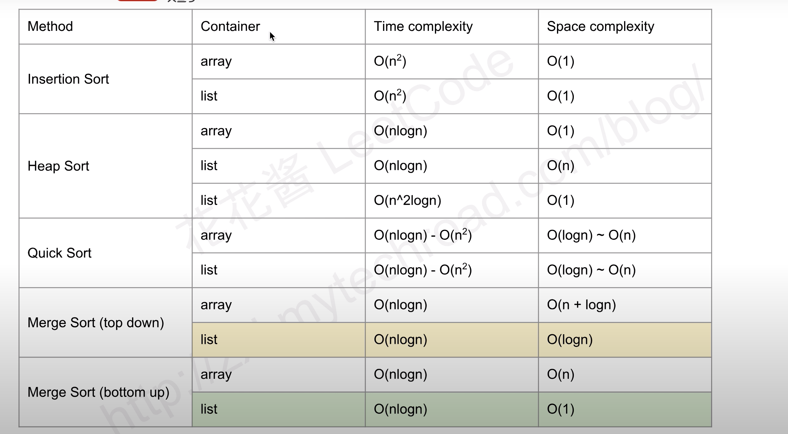

## 88. Merge Sorted Array

倒着来填写，哪个大就放后面

o(m+n)

o(1)

## 56. Merge Intervals

o(nlogn)

o(logn) - o(n) 排序需要的额外空间

## 57. Insert Interval

分成三种情况

o(n)

o(1)

## 75. Sort Colors

这里套一种排序算法即可

我这里套了快排 

o(nlogn)

o(logn)

## 147. Insertion Sort List

就是普通的比较和插入

O(n^2)

O(1)

## 148. Sort List

review : 自底向上的归并排序

https://www.youtube.com/watch?v=M1TwY0nsTZA

## 179. Largest Number

这个就是特殊排序

nlogn 

o(logn) ##  sort 空间复杂度

## 问题 STL sort如何实现

https://zhuanlan.zhihu.com/p/36274119

https://feihu.me/blog/2014/sgi-std-sort/

## 242. Valid Anagram 01 

这道题可以用个map去装，当如果字母数量相同，必然有一个会减到<=0

O(n)

O(S)  -- > O(1)

空间复杂度：O(S)，其中 SS 为字符集大小，此处 S=26S=26。

## 242. Valid Anagram 02 排序

nlog(n)

o(logn)

## 274. H-Index

o(nlogn)

o(logn)

## 581. Shortest Unsorted Continuous Subarray

先排序，然后比较

todo: 这里可以有更好的办法

o(nlogn)

o(n)

## 49. Group Anagrams

因为异构词，肯定sort后是一样的，sort后作为key，然后加入value的vector中

o(nklogk)

o(nk)

